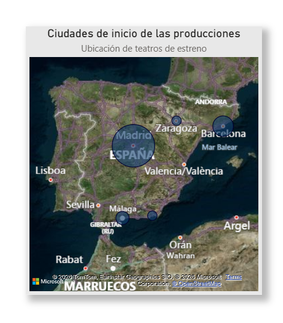

**Análisis del Teatro Musical en España (2010–2026)** — Autora: *Ela Ruiz González, Analista de Datos*. 
mail: elaruizgonzalez@gmail.com

Proyecto sectorial para detectar patrones de producción, concentración empresarial, dinámicas territoriales, explotación en gira y características artísticas mediante ETL reproducible y dashboards en Power BI orientados a decisiones culturales y de negocio.

**Datos, fuentes y metodología** — Datasets construidos desde cero en Python a partir del Anuario de Estadísticas Culturales, SGAE, webs oficiales, archivos especializados y conocimiento profesional; CSV normalizados, validados y enriquecidos con variables artísticas, temporales y geográficas; proceso documentado con notebooks ETL/EDA y visualización en Power BI.

**Proceso analítico y EDA ordenado** — ETL: integración de fuentes, normalización histórica, deduplicación, validación de tipos y enriquecimiento; EDA: auditoría de calidad, análisis territorial, giras y escalabilidad, concentración empresarial, duración media, formatos dominantes y pricing; tecnologías: Python (Pandas, NumPy), Jupyter, Matplotlib, Seaborn, Power BI, Git/GitHub, ChatGPT.
Cada notebook EDA incluye visualizaciones sistemáticas (distribuciones, outliers, correlaciones y series temporales) usadas para validar hipótesis antes del modelado en Power BI.

**Implicaciones estratégicas y decisiones para productores** — El proyecto culmina con un bloque ejecutivo de conclusiones del mercado (2010–2026), implicaciones estratégicas y decisiones operativas para productores basadas en reglas como P75/P90 para expansión y pricing.

**Hallazgos y limitaciones** — Predominio de franquicias (~73%), alta concentración empresarial, Madrid como polo inicial, >50 % de títulos en gira y longevidad extrema en pocos casos (lidera *El Rey León*). 

Precios basados en tarifas web, muestra limitada en 2026, ausencia de datos internos de taquilla, alta heterogeneidad por plaza, 71 musicales seleccionados manualmente y uso de proxies documentados.

**Repositorio, reproducción y estado**

/dashboards/ contiene los archivos de Power BI con todo el trabajo final integrado: modelos, visualizaciones y storytelling analítico.

/data_interim/ contiene los archivos intermedios generados durante el proceso de limpieza y transformación: datasets parciales, KPIs temporales y versiones previas utilizadas para validar cálculos antes de construir los modelos finales.

/data_processed/ alberga los datasets finales listos para análisis y visualización en Power BI, incluyendo el dataset maestro del sector, el pricing definitivo y el dataset de hábitos de asistencia.

/data_raw/ incluye los archivos originales en Excel y CSV sin transformar, obtenidos de fuentes públicas y recopilaciones propias, utilizados como punto de partida del proceso ETL.

/docs/ recoge la documentación final del proyecto: grabación en vídeo de la presentación, el mapa de inicios geográficos mostrado en el README y el PDF completo del análisis sectorial con storytelling y visualizaciones.

/notebooks_eda/ contiene los notebooks de análisis exploratorio para cada dataset, donde se estudian calidad de datos, territorialidad, giras, concentración empresarial, duración en cartel y pricing.

/notebooks_etl/ incluye el notebook principal del proceso ETL del dataset maestro, donde se integran fuentes, se normalizan entidades, se eliminan duplicados y se construye la estructura relacional final.

**Cómo recorrer el proyecto**

Clonar el repositorio y comenzar por /data_raw/ para ver los datos originales; continuar con /data_interim/ para entender la transformación; revisar /notebooks_eda/ para el análisis (Los EDA iniciales sirvieron para detectar inconsistencias y definir la estructura final del dataset maestro, que se construyó posteriormente en el ETL); continuar con /notebooks_etl/ consultar /data_processed/ para los datasets finales; explorar dashboards y documentación en /docs/.