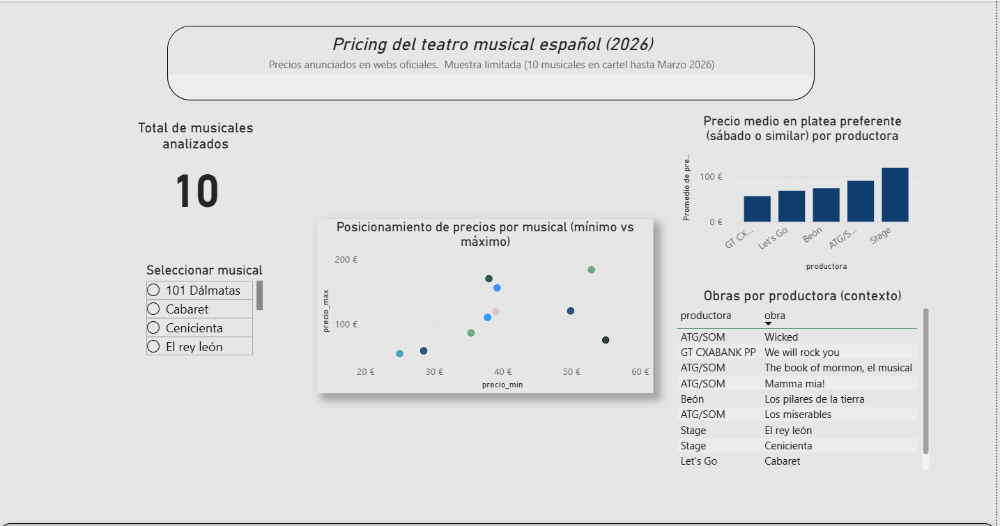
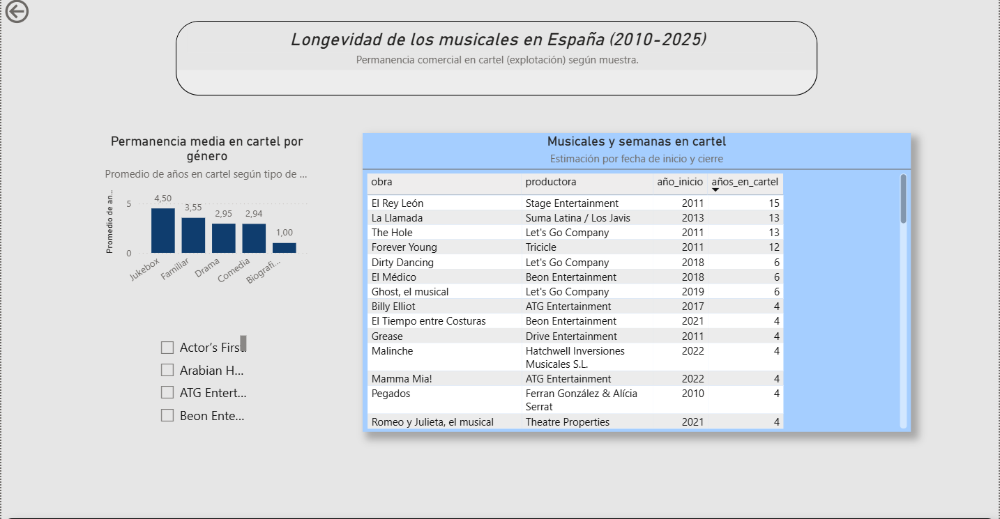

<p align="center">
  
</p>

<p align="center">
  
</p>


[Ver análisis completo en PDF](https://raw.githubusercontent.com/ela-art/Analisis-del-Teatro-Musical-2010-2026/main/docs/pdf_del_proyecto.pdf)

# Análisis del Teatro Musical en España (2010–2026)

**Autora:** Ela Ruiz González · Data Analyst  
**Estado:** Proyecto completo (modelo estrella implementado)  

Proyecto end-to-end orientado a negocio que analiza el mercado del teatro musical en España mediante la construcción de un dataset propio y un modelo analítico en Power BI. El objetivo es identificar patrones estructurales en producción, pricing, longevidad, giras y comportamiento de la demanda para apoyar decisiones estratégicas.

---

## Contexto y objetivo

El sector carece de fuentes estructuradas y comparables. Este proyecto aborda ese vacío construyendo una base de datos original para responder preguntas de negocio como:

- ¿Cómo evoluciona la producción tras shocks de demanda?
- ¿Qué factores explican la permanencia en cartel?
- ¿Cómo se estructura el pricing del mercado?
- ¿Qué papel juegan las productoras, los teatros y los géneros?

---

## Datos y metodología

Dataset construido desde cero en Python a partir de fuentes públicas (Ministerio de Cultura, SGAE, webs especializadas) y validado con conocimiento sectorial.

- 72 musicales (2010–2026)
- Variables: producción, duración, giras, pricing, asistencia, geografía
- Uso de proxies documentados (precio web, estimaciones de permanencia)

El proceso incluye:
- ETL reproducible (limpieza, normalización, deduplicación)
- Validación automática de calidad de datos (`validate_data.py`)
- EDA para validación de hipótesis
- Modelado final en Power BI

---

## Modelo de datos

Esquema en estrella con claves surrogadas en todas las dimensiones:

- `fact_producciones` → unidad de análisis (obra + año de inicio)
- `dim_obra` → género, duración, origen (`id_obra`)
- `dim_teatro` → nombre, ciudad (`id_teatro`)
- `dim_anio` → contexto temporal (`id_anio`)
- Tablas auxiliares: pricing (enlazado por `id_obra`) y hábitos de asistencia

Las relaciones en Power BI se establecen por ID entero, no por nombre de texto, garantizando estabilidad ante variaciones tipográficas.

---

## Principales hallazgos

- Mercado cíclico con recuperación clara post-pandemia  
- Alta concentración en pocas productoras y en Madrid  
- Predominio de franquicias (~70%)  
- Longevidad concentrada en pocos títulos  
- Jukebox y familiar con mayor permanencia  
- Pricing segmentado con clara jerarquía por escala y teatro  
- Demanda mayoritariamente femenina y sensible a shocks externos  

---

## Implicaciones estratégicas

- Estrenar en fases expansivas del mercado  
- Usar Madrid como hub de validación  
- Priorizar géneros comerciales para estabilidad  
- Combinar franquicias (seguridad) e IP propia (valor)  
- Alinear pricing con posicionamiento, teatro y escala  
- Diseñar estrategias de explotación diferenciadas (cartel vs gira)  

---

## Limitaciones

- Datos de pricing acotados a cartelera activa 2025–2026, sin cobertura histórica de precios  
- Ausencia de datos reales de taquilla  
- Uso de proxies (precio web, estimaciones de permanencia)  
- Heterogeneidad entre plazas y teatros  

---

## Stack técnico

Python (Pandas, NumPy) · Jupyter Notebook · Power BI · Git / GitHub

---

## Estructura del repositorio

```
data_raw/                                          <- punto de entrada del pipeline
  maestro_musicales.csv                            <- dataset maestro (72 producciones, 2010-2026)
  precios_musicales_limpio.csv                     <- muestra inicial de precios (8 musicales)
  precios_musicales_limpio_final.csv               <- muestra ampliada de precios (10 musicales)

data_interim/
  maestro_musicales.csv                            <- copia intermedia del maestro antes del ETL final

notebooks_etl/
  01_ETL_star_schema.ipynb                         <- pipeline ETL ejecutable (genera data_processed/)

notebooks_eda/
  Eda_precio_musicales_limpio_definitivo.ipynb     <- analisis de precios actuales (version final)
  Eda_teatro_musical_habitos.ipynb                 <- analisis de demanda por genero y ano

data_processed/                                    <- generado por el pipeline, alimenta Power BI
  fact_producciones.csv
  dim_obra.csv
  dim_teatro.csv
  dim_anio.csv
  maestro_musicales_final.csv
  precios_musicales_limpio_definitivo.csv          <- precios de cartelera 2025-2026 (limpio)
  teatro_musical_habitos_2011_2025_limpio.csv      <- habitos de asistencia (limpio)

validate_data.py                                   <- script de validacion automatica de calidad de datos
dashboards/
  v2_modelo_estrella.pbix                          <- dashboard Power BI
docs/
  pricing.png                                      <- grafica de pricing incluida en el README
  longevidad.png                                   <- grafica de longevidad incluida en el README
  grafica_pricing1.png                             <- grafica auxiliar de pricing
  pdf_del_proyecto.pdf                             <- version PDF del analisis completo
  Teatro_Musical_España_Resumen_Analitico.pdf      <- resumen analitico del proyecto

_archive/                                          <- archivos no esenciales para el pipeline
```

---

## Cómo ejecutar el proyecto

### Requisitos

```bash
# Python 3.10+
pip install pandas numpy matplotlib seaborn openpyxl
```

Power BI Desktop (gratuito): [descargar aquí](https://powerbi.microsoft.com/es-es/desktop/)

### Pipeline — ejecutar en orden

| Paso | Archivo | Descripción |
|---|---|---|
| 1 | `notebooks_etl/01_ETL_star_schema.ipynb` | Lee `data_raw/` → genera `data_processed/` |
| 2 | `python validate_data.py` | Valida calidad de los CSV generados |
| 3 | `notebooks_eda/Eda_precio_musicales_limpio_definitivo.ipynb` | EDA de precios 2025–2026 |
| 4 | `notebooks_eda/Eda_teatro_musical_habitos.ipynb` | EDA de hábitos de asistencia |
| 5 | Abrir `dashboards/v2_modelo_estrella.pbix` → **Actualizar** | Power BI |

### Validación automática

El script `validate_data.py` comprueba automáticamente que los CSV generados son correctos:

```
python validate_data.py
```

Verifica: recuentos de filas, ausencia de nulos en campos clave, unicidad de IDs e integridad referencial entre tablas. Devuelve exit code 0 si todo es correcto.

---

## Mejoras futuras

- Integrar datos reales de taquilla (ticket medio, ocupación)  
- Ampliar cobertura histórica de precios (actualmente solo 2025–2026)  
- Ampliar dataset con nuevas producciones de forma continua  
- Modelos predictivos de permanencia y éxito comercial  
- Automatizar pipelines de ingesta y actualización  

---

## Autora

Ela Ruiz González  
Data Analyst  
elaruizgonzalez@gmail.com

---

## _archive/

Archivos no imprescindibles para el pipeline, conservados por trazabilidad:

- `musicales_listado.xlsx` — fuente de consulta manual usada durante la construcción del dataset
- `obras_sin_duracion.xlsx` — auxiliar de validación manual
- `00_CONTEXTO_origen_dataset.ipynb` — documentación del origen del dataset (no ejecutable)
- `EDA_maestro_validacion.ipynb` — exploración borrador del dataset maestro
- `Eda_precios_musicales_limpio.ipynb` — borrador del EDA de precios
- `kpis_teatros_anios_en_cartel.csv` — output generado durante exploración, no es input del pipeline
